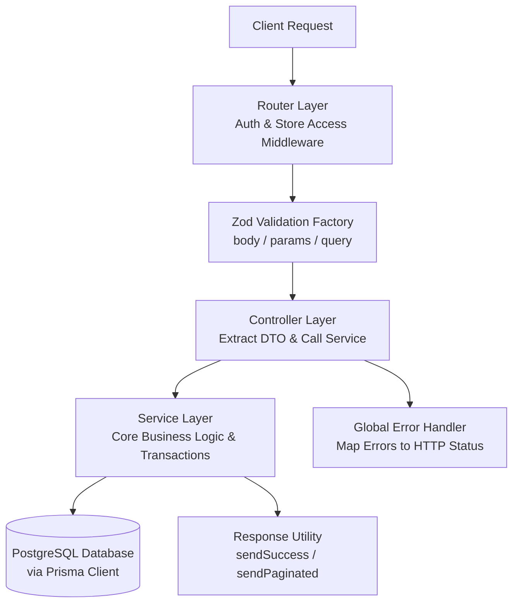

# 🧠 BẢN TÓM TẮT DỰ ÁN CHO AI AGENT (AI_CONTEXT_SUMMARY)

> **HƯỚNG DẪN DÀNH CHO AI AGENT TRONG PHIÊN LÀM VIỆC MỚI:**
> Hãy đọc kỹ tài liệu này trước khi phân tích mã nguồn hoặc thực hiện bất kỳ thay đổi nào. Tài liệu cung cấp toàn bộ bối cảnh hệ thống, quy chuẩn kiến trúc và luồng xử lý chuẩn xác của backend **Orderly POS**.

---

## 1. 🚀 TỔNG QUAN DỰ ÁN (Orderly POS Backend)
**Orderly** là hệ thống REST API dành cho ứng dụng Quản lý bán hàng (POS) quán cà phê. Hệ thống được thiết kế hướng tới tính ổn định cao, bảo mật chặt chẽ và nhất quán dữ liệu ở mức độ **Production-Ready**.

### 🛠️ Stack Công Nghệ Chính
- **Runtime & Ngôn ngữ**: Node.js 24 (LTS) + TypeScript 5.x (Strict mode).
- **Framework**: Express.js 4.x.
- **Database & ORM**: PostgreSQL 16 + Prisma ORM 7.x.
- **Validation**: Zod 3.x (Schema-first validation).
- **Authentication**: JSON Web Token (JWT) + Bcrypt (12 rounds).
- **Hệ thống Import**: Tích hợp toàn diện **Import Aliases (`@/`)** ánh xạ tới thư mục `src/` (thực thi biên dịch qua `tsc && tsc-alias`).

---

## 2. 🏛️ KIẾN TRÚC HỆ THỐNG & LUỒNG HOẠT ĐỘNG
Hệ thống tuân thủ nghiêm ngặt kiến trúc phân tầng **Router - Controller - Service - Schema**. Tuyệt đối không gộp chung logic của các tầng này với nhau.



### 🌊 Luồng Hoạt Động (Flow) Chuẩn
1. **Tiếp nhận Request**: Client gửi HTTP request tới endpoint tương ứng.
2. **Xác thực & Phân quyền (Middleware Layer)**:
   - `authenticate`: Xác thực JWT Bearer Token, đính kèm thông tin `req.user`.
   - `requireStoreAccess`: Truy xuất `storeId` từ param, kiểm tra quyền sở hữu của user, đính kèm `req.store`.
3. **Tiền xử lý Dữ liệu (Validation Layer)**:
   - Middleware `validate(schema)` sử dụng Zod schema để kiểm tra, làm sạch (sanitize) và ép kiểu dữ liệu đầu vào (`req.body`, `req.params`, `req.query`).
4. **Điều phối (Controller Layer)**:
   - Thuần túy tiếp nhận dữ liệu đã được validate.
   - Gọi hàm từ Service tương ứng.
   - Trả về kết quả thông qua các hàm chuẩn hóa: `sendSuccess` hoặc `sendPaginated`.
   - Chuyển tiếp lỗi (`catch (err) { next(err); }`) xuống Error Handler.
5. **Xử lý Nghiệp vụ (Service Layer)**:
   - Chứa 100% business logic, tương tác cơ sở dữ liệu qua `prisma`.
   - Sử dụng `prisma.$transaction` cho các thao tác phụ thuộc nguyên tử (ACID).
   - Ném lỗi bằng class tập trung `ApiError` (ví dụ: `ApiError.notFound('Store')`).

---

## 3. 📂 CẤU TRÚC THỨ MỤC & QUY TẮC ĐẶT TÊN
Dự án áp dụng mô hình chia theo **Feature Modules** để tối ưu hóa khả năng bảo trì:

```text
orderly-be/
├── package.json                  # Scripts: build (tsc && tsc-alias), dev, start
├── tsconfig.json                 # Thiết lập baseUrl: "./" và paths: { "@/*": ["src/*"] }
├── prisma/
│   ├── schema.prisma             # Định nghĩa 10 Models chuẩn
│   └── seed.ts                   # Dữ liệu khởi tạo hệ thống mẫu
└── src/
    ├── index.ts                  # Entry point: listen port
    ├── app.ts                    # Khởi tạo Express, gắn Middleware, Routes, Scalar Docs
    ├── config/                   # env.ts (Zod env), prisma.ts (Singleton db client)
    ├── lib/                      # Tiện ích: response.ts, jwt.ts, hash.ts, pagination.ts
    ├── middleware/               # authenticate.ts, requireStoreAccess.ts, validate.ts, errorHandler.ts
    ├── docs/                     # OpenAPI 3.1 Spec & Scalar UI schemas/paths
    ├── types/                    # express.d.ts (mở rộng req.user, req.store)
    └── modules/                  # Các feature modules độc lập
        ├── auth/                 # Đăng ký, đăng nhập, thông tin user
        ├── stores/               # Quản lý cửa hàng (Tự động sinh 3 statuses mặc định)
        ├── categories/           # Danh mục thực đơn
        ├── menu-items/           # Món ăn / đồ uống
        ├── areas/                # Khu vực bàn (Tự động đồng bộ số lượng bàn)
        ├── tables/               # Trạng thái bàn (empty / serving)
        ├── statuses/             # Quy trình xử lý đơn (start -> mid -> end)
        ├── orders/               # Xử lý đơn hàng (Gộp/tách món, snapshot giá, chuyển bước)
        ├── invoices/             # Thu chi, phiếu nhập nguyên liệu
        └── dashboard/            # Thống kê tổng quan (Doanh thu, chi phí, món bán chạy)
```

### 🏷️ Quy Tắc Đặt Tên (Naming Conventions)
- **File Route**: `<module>.routes.ts` (Ví dụ: `orders.routes.ts`)
- **File Controller**: `<module>.controller.ts` (Ví dụ: `orders.controller.ts`)
- **File Service**: `<module>.service.ts` (Ví dụ: `orders.service.ts`)
- **File Schema**: `<module>.schema.ts` (Ví dụ: `orders.schema.ts`)
- **Tên Biến/Hàm**: `camelCase`.
- **Tên Class/Model/Type**: `PascalCase`.

---

## 4. 📜 QUY TẮC PHÁT TRIỂN & CHỈNH SỬA CODE
Khi AI Agent được yêu cầu chỉnh sửa hoặc thêm mới tính năng, **BẮT BUỘC** tuân thủ các tiêu chuẩn sau:

### 1. Chuẩn Hóa Import (Import Aliases)
- **TUYỆT ĐỐI KHÔNG** sử dụng đường dẫn tương đối trỏ ra ngoài thư mục module (như `../../config/prisma`).
- **LUÔN LUÔN** sử dụng alias `@/` cho mọi import nội bộ:
  ```typescript
  import { prisma } from '@/config/prisma';
  import { ApiError, sendSuccess } from '@/lib/response';
  import { validate } from '@/middleware/validate';
  ```

### 2. Chuẩn Hóa API Response
Mọi phản hồi HTTP trả về cho Client phải tuân theo định dạng chuẩn duy nhất được quản lý bởi `src/lib/response.ts`:
- **Thành công (Đơn lẻ)**: `{ "success": true, "data": { ... }, "message": "..." }`
- **Thành công (Phân trang)**: `{ "success": true, "data": [ ... ], "pagination": { "page": 1, "limit": 20, "total": 100, "totalPages": 5 } }`
- **Thất bại**: `{ "success": false, "error": { "code": "...", "message": "...", "details": [...] } }`

### 3. Nguyên Tắc Controller & Service
- **Controller**: Không chứa logic tính toán hay truy vấn cơ sở dữ liệu. Mọi thao tác bắt buộc gọi qua hàm của file `.service.ts`.
- **Service**: 
  - Không truy cập đối tượng `req` hoặc `res`.
  - Ném lỗi nghiệp vụ bằng class `ApiError` (Ví dụ: `throw ApiError.badRequest('Thông báo lỗi');`).
  - Kiểm tra kỹ quyền sở hữu (Authorization chéo) để đảm bảo dữ liệu (như `category`, `menuItem`) thực sự thuộc về `storeId` đang request.

### 4. Database & Prisma
- Mọi thay đổi về cấu trúc bảng cần thực hiện trong `prisma/schema.prisma` và chạy `npx prisma generate` để cập nhật Type.
- Các nghiệp vụ ghi nhận hoặc chuyển đổi trạng thái phức tạp (như tạo đơn hàng kèm các món) phải gói gọn trong `prisma.$transaction`.

### 5. Tài Liệu OpenAPI & Scalar UI
Khi thêm mới Route/Endpoint:
- Bổ sung định nghĩa schema request/response tương ứng vào `src/docs/schemas/<module>.schemas.ts`.
- Định nghĩa chi tiết đường dẫn, method, mô tả và gắn schema vào `src/docs/paths/<module>.paths.ts`.
- Giao diện tài liệu trực quan tự động hiển thị tại `http://localhost:3000/docs` khi chạy chế độ phát triển.

---

## 5. 🛠️ CÁC LỆNH VẬN HÀNH DỰ ÁN
```bash
# Cài đặt gói phụ thuộc
npm install

# Khởi chạy server phát triển (Hot-reload với tsx)
npm run dev

# Kiểm tra kiểu và Biên dịch mã nguồn ra thư mục dist/ (Sử dụng tsc & tsc-alias)
npm run build

# Chạy server ở chế độ Production (Yêu cầu build trước)
npm start

# Cập nhật Prisma Client sau khi đổi schema
npx prisma generate

# Reset và nạp dữ liệu mẫu khởi tạo
npm run seed
```
